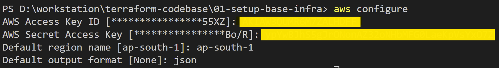

# 01-setup-base-infra

## Prerequisites

This step is required so that Terraform can authenticate its API request on Cloud Provider (in our case AWS). 

We would need to create access key and secret against a IAM User. There are multiple ways of doing this, but I am noting down two approaches, for reference.

You would need to create Access Key and Secret Key.

### AWS configuration.

Once access key and secrets are created trigger following command and enter the details.

    

OR 

### AWS Profile Configuration

Ensure that the terraform-codebase profile exists in your AWS credentials file (~/.aws/credentials on Windows). If you have aws package installed, you will find .aws folder under 

    C:\Users\<<Username>>\.aws

Note : If the profile is missing or misconfigured, Terraform will fail to authenticate. You can have single / multiple profiles added in .aws/credential file.

    [terraform-codebase]
    aws_access_key_id = YOUR_ACCESS_KEY
    aws_secret_access_key = YOUR_SECRET_KEY

## Purpose of this IaaC
Setup base infrastructure. 
This IaaC script can be used whenever 
* EC2 Ubuntu Instance is required to be provisioned
* Have prerequisites installed when EC2 is getting provisioned. 
* Stream logs from EC2 to CloudWatch LogGroup
* Have Public and Private Networks setup for restrictive Application access.
* Have setup in two AZs for High Availability.
* Have bare minimum Security Group attached to EC2.

Note : 

* I am aware the code is not modular. But it serves the purpose of setting up cloud infra.
* I have not setup NAT for outbound access of Private Network.
* I have not setup jumpbox to access Instances from Private Network.

## Detail of Resources Provisioned
* Provider Details (You can have single / multiple providers created)
* VPC
* Internet Gateway
* Route Table
* Route Table Association
* Availabity Zones 
* Subnet

    * Setup 2 Public and 2 Private Subnets
    * We should have Public and Private Networks setup for our Internal and External Application resource provisioning.
    * We have used two separate Avalibility Zone. Each AZ has Public and Private Network to provision respective resources.
    * This design help in High Availability. When one AZ goes down, another AZ with similar public and private subnet would be available.
* Security Group
* Security Group Rules

    * INGRESS : EC2 can be accessed via Ping, SSH, HTTP from Internet
    * EGRESS : EC2 are open outbound to internet. 
* IAM Role 

    * Create a CloudWatch Role
* IAM Policy 

    * Allow CreateLogGroup, CreateLogStream, PutLogEvents Actions 
* IAM Role Policy Attachment

    * Map IAM Role and IAM Policy ARN
* IAM Instance Profile

    * Create an Instance Profile to Attach IAM Role
* CloudWatch LogGroup

    * Create a CloudWatch LogGroup
* Key Pairs

    * Attach this KeyPair to EC2 Instance.
    * Helps in SSH.

* EC2 Instance

    * Provision EC2 Instance.
    * Attach Instance Profile. This would map IAM Role created so that Instance can stream logs to CloudWatch LogGroup
* Userdata Script

    * Redirect all logs to /var/log/userdata.logs file
    * Install necessary OS updates and packages
    * Install AWS CLI
    * Wait for Metadata service to be available.
    * Fetch token from Instance Metadata Service
    * Fetch InstanceId and Public IPv4 using Metadata service.
    * Create index.html file under /var/www/html directory with Public IPv4 info.
    * Start NGINX
    * Install CloudWatch Agent
    * Update CloudWatch agents config.json file, to read logs from /var/log/userdata.log and stream it to log_group having a log_stream
    * Start CloudWatch Agent
    * Check CloudWatch Agent Status 

